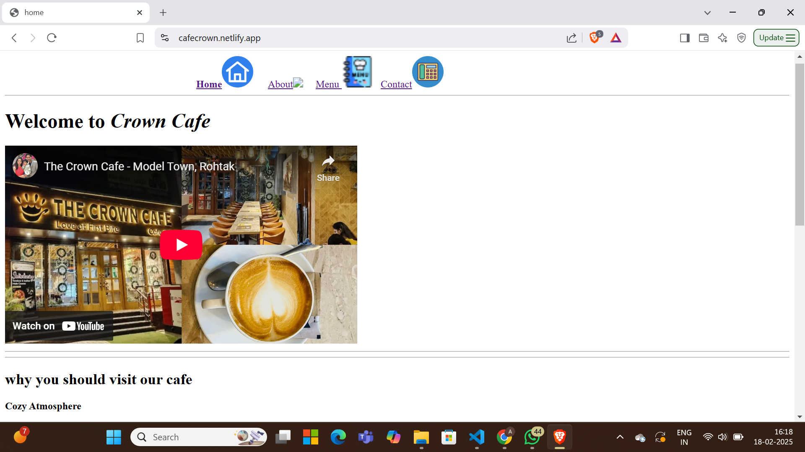

# Cafe Crown 

Welcome to CafeCrown's Handbook!
This is a open-source project serves as a handbook for various type of food and cheat meals  taught in Crown Cafe.

 Where we're passionate about serving more than just great coffee. Our cafe is a haven for coffee lovers, foodies, and anyone looking for a warm and welcoming atmosphere to relax and unwind.

 At Cafe Crowm, we're dedicated to providing an exceptional customer experience that goes beyond just serving coffee. Our team is passionate about crafting unique and delicious beverages, using only the finest ingredients and expert techniques. From our signature Crowm Coffee to our seasonal specials, every drink is made with love and care to ensure that every sip is a delight.

## What Sets Us Apart

- Expertly Crafted Beverages: Our team of skilled baristas are dedicated to creating unique and delicious drinks that will tantalize your taste buds.

- Cozy Atmosphere: Our café is designed to be a warm and welcoming space, perfect for relaxing and unwinding with friends, family, or solo.

- Seasonal Specials: We're always innovating and introducing new and exciting seasonal specials to keep our menu fresh and exciting.

- Community Focus: We're committed to supporting local artists, musicians, and suppliers to create a vibrant and thriving community

## How To Contribute 

We Welcome contributions from the community to help us expand and improve this handbook. If you would like to contribute, follow these steps:

1. fork the repository to your GitHub account.
2. Make your changes, add new content, or fix any existing issues.
3. Open a new pull request in this repository.

## Contributor 

